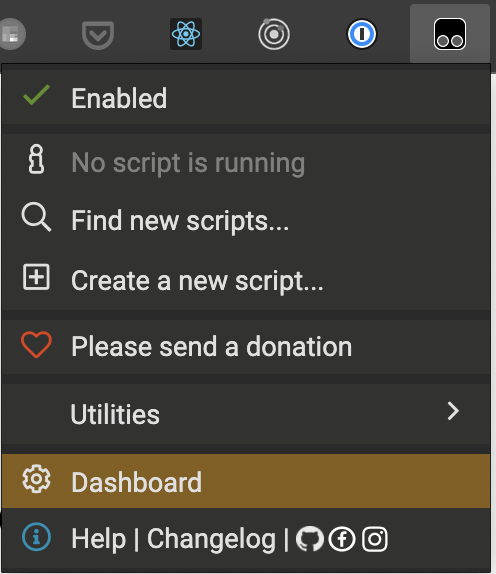
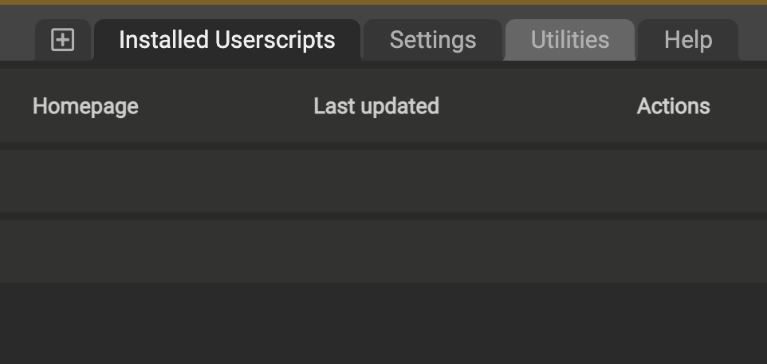
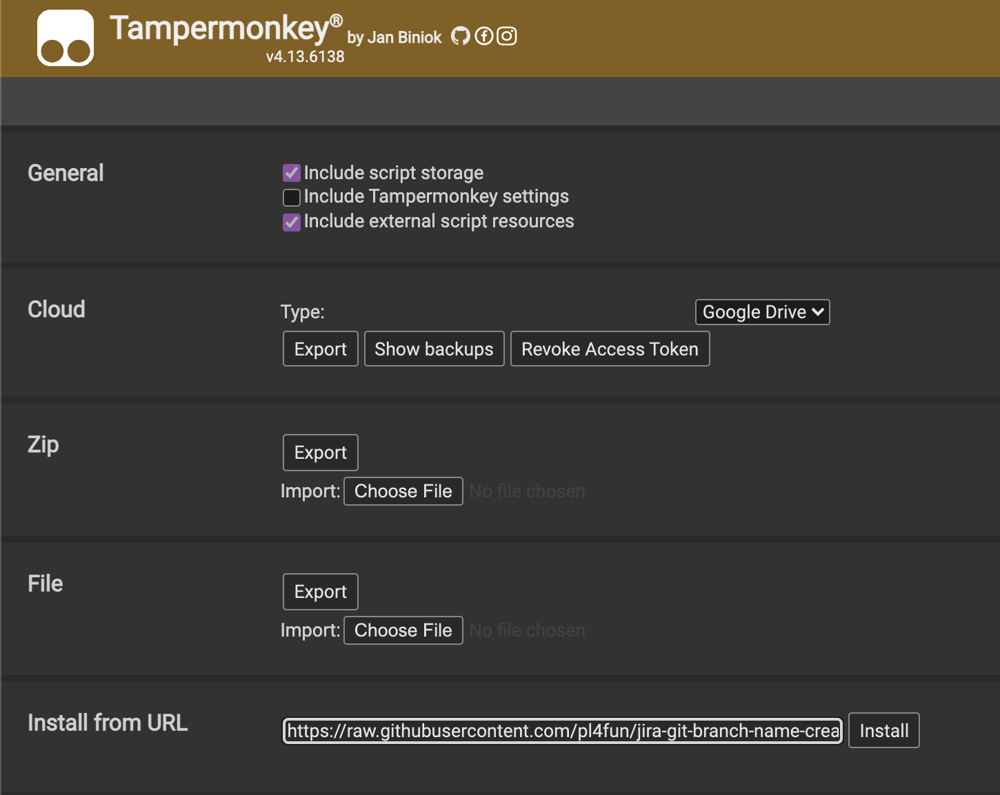
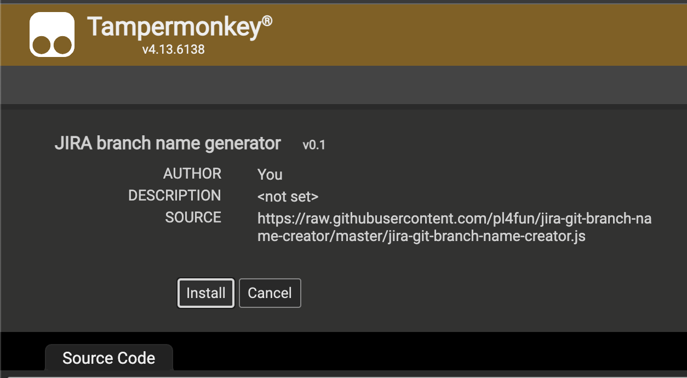
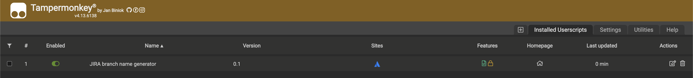
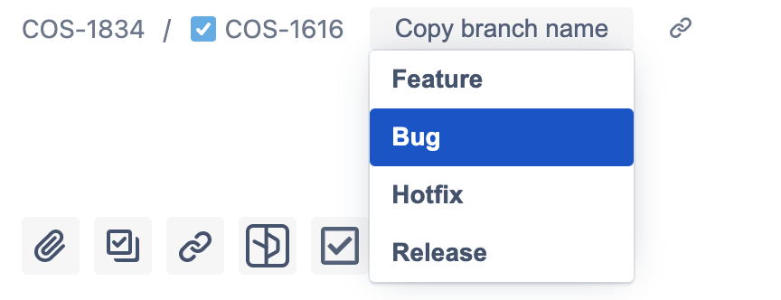
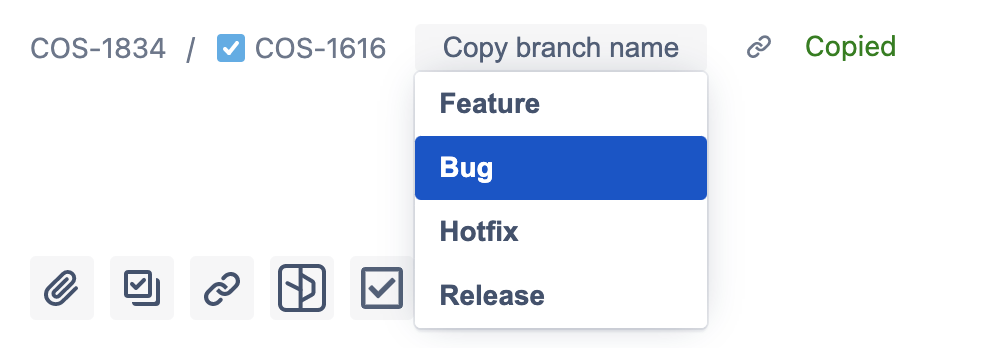

# branch-name-creator

# 1. Download extension:
- [chrome](https://chrome.google.com/webstore/detail/tampermonkey/dhdgffkkebhmkfjojejmpbldmpobfkfo)
- [edge](https://microsoftedge.microsoft.com/addons/detail/tampermonkey/iikmkjmpaadaobahmlepeloendndfphd)
- [firefox](https://addons.mozilla.org/en-US/firefox/addon/tampermonkey/)
- [safari](https://apps.apple.com/app/apple-store/id1482490089)

# 2. In browser open the extension Dashboard

  

# 3. Click on Utilities on the top right hand side

  

# 4. Paste the url `https://raw.githubusercontent.com/pl4fun/jira-git-branch-name-creator/master/jira-git-branch-name-creator.js` at the import from URL section

  
  
  
# 5. Click Install

  

  * script myst be installed 

# 6. Go to jira ticket and you will see the `Copy branch name` button next to the jira id

  

  

# 7. Now you can choose a prefix for the brunch, just select the prefix you want to add

Now you have the branch name in the Clipboard in format: `<issue type>/<issue id>-<issue name>`

For example: `bug/COS-1616-bla-bla-bla`

Now the branch name is in your clipboard 🥳🎉🎆
